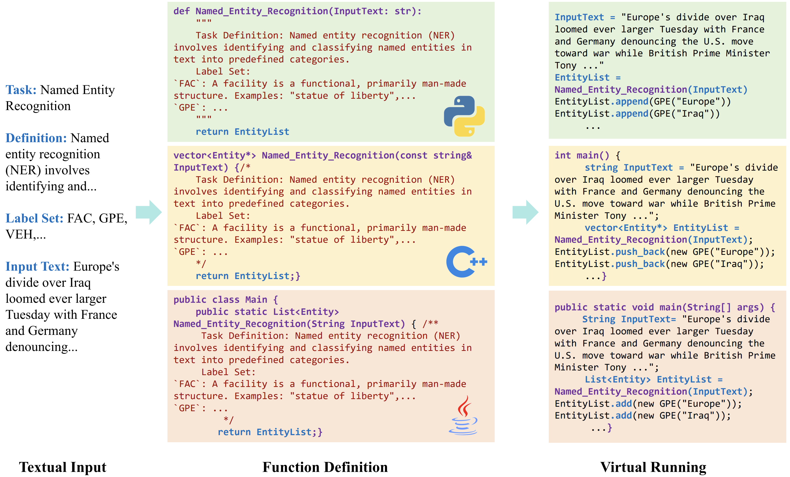

<p align="center">
    <br>
    
    <br>
    <h2 align="center">MPL: Multiple Programming Languages with Large Language Models for Information Extraction [ACL'25 Findings]
    <br>
     <em>
    <a href="https://deepblue666.github.io/">Bo Li</a>, Gexiang Fang, Wei Ye, Zhenghua Xu, Jinglei Zhang, Hao Cheng and Shikun Zhang
  </em> </h2>
</p>

<p align="center">
    <a href="https://github.com/PKU-Fgx/MPL/blob/main/LICENSE"></a>
    <a href="https://arxiv.org/abs/2505.16107"></a>
    <br>
</p>

<p align="justify">
We present <i>MPL: Multiple Programming Languages with Large Language Models for Information Extraction</i>. Recent advances in information extraction (IE) have explored the use of code-style prompts to improve structured output generation. This approach leverages the inherent structure of programming languages (PLs), which are often more precise and organized than natural language. While most existing work focuses on Python as the primary PL for simulation and fine-tuning, our framework MPL extends this paradigm by incorporating multiple widely-used programming languages, such as C++, Java, and Python, into the supervised fine-tuning (SFT) process. This allows the model to learn cross-language structural patterns that enhance IE performance. To further improve the code-style simulation, we introduce a novel function-prompt with virtual execution, enabling more effective and efficient generation of structured outputs. This repository contains the implementation, training scripts, and evaluation tools for MPL. Please refer to the supplementary materials for more details and trained models.
</p>

- 📖 Paper: [MPL: Multiple Programming Languages with Large Language Models for Information Extraction](https://arxiv.org/abs/2505.16107)

<p align="center">

</p>

## 🏗️ Repo Structure

```text
project/
├── dataPreparation/          # Data preprocessing module
│   ├── Formatted/            # Output of formatted data
│   ├── Raw/                  # Original data and related processing
│   │   ├── EAE/
│   │   ├── EE/
│   │   ├── NER/
│   │   └── RE/
│   ├── build.py              # Converts raw data into formatted data
│   ├── prompt.py             # Transforms IE data into Code-style Format Prompt
│   └── generate_datasets.ipynb  # Generates complete datasets for training
├── train/                    # Training-related code
│   ├── scripts/              # Training scripts
│   ├── open_instruct/        # Core training code
│   └── run_mpl.sh            # Entry script
├── evaluation/               # Evaluation module
└── dataTrain/                # Storage for training data
```

## 📥 Installation

1. Clone the repository:
```bash
git clone https://github.com/PKU-Fgx/MPL.git
cd MPL
```

2. Install dependencies:
```bash
# Environment setup
conda create -n MPL python=3.12 -y
conda activate MPL

# install dependencies
pip install -r requirements.txt
```

## 🏋️ Training Steps

### 1. Data Preprocessing

#### 1. Obtain the raw datasets

| Task | Dataset | Link | Label Explanations | Domain |
|------|---------|------|--------------------|--------|
| NER | ACE05 | [ACE 2005](https://catalog.ldc.upenn.edu/LDC2006T06) | ✅ | News |
| NER | BC5CDR | [tner/bc5cdr](https://huggingface.co/datasets/tner/bc5cdr) | ❌ | Biomedical |
| NER | CoNLL03 | [conll2003](https://www.clips.uantwerpen.be/conll2003/ner/) | ❌ | News |
| NER | DIANN | [diann-sentences-english](https://huggingface.co/datasets/ferrazzipietro/diann-sentences-english) | ❌ | Biomedical |
| NER | NCBID | [ncbi-disease](https://huggingface.co/datasets/nr2n23/ncbi-disease-sequence-classification) | ❌ | Biomedical |
| NER | OntoNotes5* | [OntoNotes 5.0](https://www.ldc.upenn.edu/) | ❌ | News |
| NER | WNUT2017 | [tner/wnut2017](https://huggingface.co/datasets/tner/wnut2017) | ❌ | News |
| RE | ACE05 | [ACE 2005](https://catalog.ldc.upenn.edu/LDC2006T06) | ✅ | News |
| RE | CoNLL04 | [DFKI-SLT/conll04](DFKI-SLT/conll04) | ❌ | News |
| EAE | ACE05 | [ACE 2005](https://catalog.ldc.upenn.edu/LDC2006T06) | ✅ | News |
| EAE | RAMS | [RAMS](https://nlp.jhu.edu/rams/) | ❌ | News |
| EE | ACE05 | [ACE 2005](https://catalog.ldc.upenn.edu/LDC2006T06) | ✅ | News |

- The raw data should be placed under `dataPreparation/Raw/<TASK>`, and each task directory must contain:
    - `label_exp.json`: Label definitions and explanations
    - `label_map.json`: Label mappings
    - `train.json`: Training data
    - `dev.json`: Validation data
    - `test.json`: Test data

> Note: Some datasets like ACE05 include label explanations, but others do not. For those without explanations, we provide AI-generated versions in `dataPreparation/Raw/<TASK>`.

> Additionally, to maintain comparability and increase training efficiency, we sampled 30k entries from the OntoNotes5 dataset for training.

#### 2. Convert raw datasets to intermediate format

- Since raw data formats vary, we provide reference scripts (`trans_<TASK>.py`) in `dataPreparation/Raw/<TASK>/` to convert them into an intermediate format. To standardize labels across datasets, we also provide `reformat.py` in the same directory.

- Before proceeding, ensure you prepare a `label_exp.json` file for each dataset, representing label explanations as `{"label": "Explanation"}`.

- For detailed intermediate format specifications per dataset, refer to `dataPreparation/README.md`.

#### 3. Transform intermediate data into CodeIE format

- After the above steps, place intermediate format files at `dataPreparation/Raw/<TASK>/<DATASET>/<SPLIT>.json`. Use `dataPreparation/build.py` to generate CodeIE-formatted datasets, which will be saved under `dataPreparation/Formatted`.

#### 4. Generate training-ready datasets

- Finally, use the `dataPreparation/generate_datasets.ipynb` script to consolidate the data into the Open-Instruct format, placing it under the `dataTrain` folder.

---

### 2. Model Training

We utilize [allenai/open-instruct](https://github.com/allenai/open-instruct) for fine-tuning. Refer to `train/run_mpl.sh`, `train/scripts/MPL_qlora.sh`, and `train/scripts/run.sh` for more details.

```bash
# Run MPL training script
bash train/run_mpl.sh
```

---

### 3. Model Evaluation

We use [vllm-project/vllm](https://github.com/vllm-project/vllm) for inference and evaluation. Refer to `evaluation/README.md` for more details.

```bash
# Evaluate using vLLM
python evaluation/eval_vllm.py --model_id <model_id> --base_model_path <base_model_path> --lan <language>

# Calculate evaluation scores
python evaluation/get_scores.py --model_id <model_id> --method <method>
```

---

## 📝 Citation
```bibtex
```
